# SongGenAI

SongGenAI is a Django-based domain layer prototype for an AI song generation platform.  
This project focuses on modeling the core business entities and relationships of the system, including song generation requests, generated songs, libraries, sharing, users, and credit transactions.

This implementation was developed for **Exercise 3: Domain Layer Implementation Using Django**.  
The focus of this project is on **domain modeling and persistence** using Django ORM rather than UI design or real AI generation integration.

---

## Project Overview

The system supports the following core flow:

1. A **Creator** submits a **Form** as a song generation request.
2. The system creates a mock **Song** from that form.
3. Generated songs belong to the creator and collectively represent the creator’s song history.
4. A creator can organize selected songs into one or more **Libraries**.
5. A song can be **shared** through a generated token and share link.
6. Credit usage is recorded through **CreditTransaction**.

---

## Main Features

- Django ORM domain modeling
- Data persistence with SQLite
- Relationships between domain entities
- Mock song generation from forms
- Song management and library organization
- Share token generation for songs
- Credit transaction tracking
- Django admin support for CRUD operations
- Basic route/controller/service structure for future extension beyond admin

---

## Domain Entities

The main domain entities in this project are:

- **Creator**
- **Listener**
- **Form**
- **Song**
- **Library**
- **Share**
- **CreditTransaction**

---

## Domain Relationships

The current design uses the following relationships:

- One **Creator** can have many **Forms**
- One **Creator** can have many **Songs**
- One **Creator** can have many **Libraries**
- One **Creator** can have many **CreditTransactions**
- One **Form** generates one **Song**
- One **Library** can contain many **Songs**
- One **Song** can belong to many **Libraries**
- One **Song** can have many **Shares**

---

## Project Structure

```text
project_root/
├── app/
│   ├── controllers/
│   │   ├── generation_controller.py
│   │   ├── playback_controller.py
│   │   ├── song_manager_controller.py
│   │   └── user_controller.py
│   │
│   ├── models/
│   │   ├── __init__.py
│   │   ├── creator.py
│   │   ├── credit_transaction.py
│   │   ├── form.py
│   │   ├── library.py
│   │   ├── listener.py
│   │   ├── share.py
│   │   └── song.py
│   │
│   ├── routes/
│   │   ├── __init__.py
│   │   ├── generation_urls.py
│   │   ├── manager_urls.py
│   │   ├── playback_urls.py
│   │   └── user_urls.py
│   │
│   ├── services/
│   │   ├── __init__.py
│   │   ├── generation_service.py
│   │   ├── playback_service.py
│   │   ├── song_manager_service.py
│   │   └── user_service.py
│   │
│   ├── migrations/
│   │   └── ...
│   │
│   ├── admin.py
│   ├── apps.py
│   └── tests.py
│
├── config/
│   ├── settings.py
│   ├── urls.py
│   ├── asgi.py
│   └── wsgi.py
│
├── .gitignore
├── LICENSE
├── manage.py
└── README.md
```

---

## Installation and Setup

### 1. Clone the repository

```bash
git clone https://github.com/Lemonef/SongGenAI.git
cd SongGenAI
```

### 2. Create and activate a virtual environment

#### Windows

```bash
python -m venv venv
venv\Scripts\activate
```

#### macOS / Linux

```bash
python3 -m venv venv
source venv/bin/activate
```

### 3. Install dependencies

```bash
pip install django
```

### 4. Apply migrations

```bash
python manage.py makemigrations
python manage.py migrate
```

### 5. Create a superuser

```bash
python manage.py createsuperuser
```

### 6. Run the application

```bash
python manage.py runserver
```

### 7. Open the application

* Main page: `http://127.0.0.1:8000/`
* Admin page: `http://127.0.0.1:8000/admin/`

---

## Supporting Configuration Files

The project includes the following supporting configuration files required to run the application:

* `config/settings.py` — Django project settings
* `config/urls.py` — main URL configuration
* `config/asgi.py` — ASGI entry point
* `config/wsgi.py` — WSGI entry point
* `.gitignore` — ignored local/system files
* `manage.py` — Django management entry point

---

## CRUD Functionality

CRUD functionality in this project was demonstrated primarily through the **Django Admin panel**, which provides an interface for managing the implemented domain entities.

The following operations were tested:

### Create

New records were created for the main entities, including **Creator**, **Listener**, **Form**, **Song**, **Library**, **Share**, and **CreditTransaction**.

### Read

Stored records were viewed in the Django Admin panel to confirm that data was correctly saved in the database and that relationships between entities were maintained correctly.

### Update

Existing records were modified through the admin interface, such as editing creator information, updating form details, modifying song data, and changing library contents.

### Delete

Records were deleted from the admin interface to verify that entities could be removed correctly from the database.

### Relationship Validation

The CRUD process also confirmed that the main domain relationships work as expected, such as:

* a **Creator** owning multiple **Forms**, **Songs**, **Libraries**, and **CreditTransactions**
* a **Form** generating a **Song**
* a **Library** containing multiple **Songs**
* a **Song** having multiple **Shares**

This demonstrates that the project supports the required persistence and basic CRUD operations for the domain layer implementation.

---

## Evidence of CRUD Functionality

The following screenshots from the Django Admin panel demonstrate CRUD operations and relationship validation.

### Create

**Create Creator**
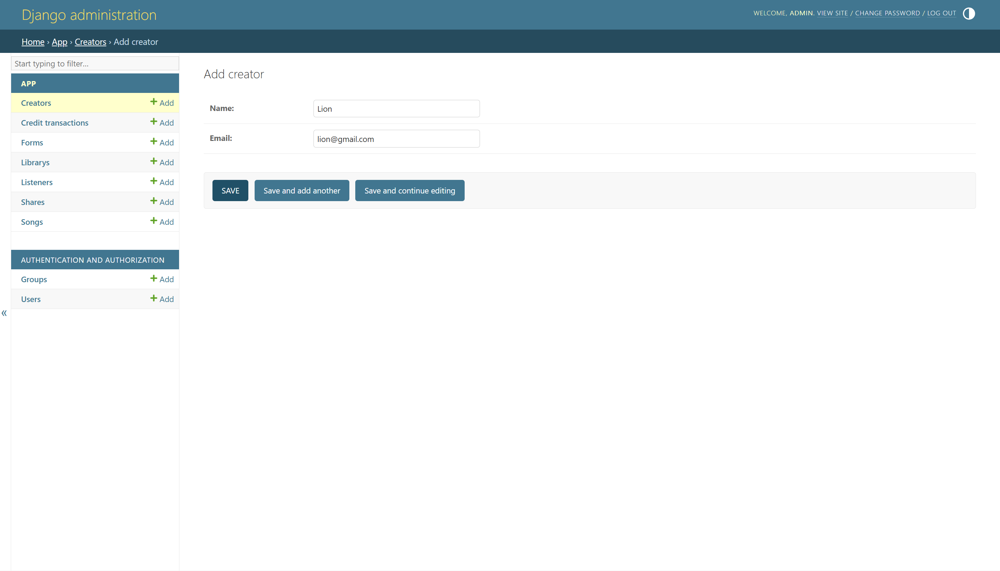

**Creator Created Successfully**
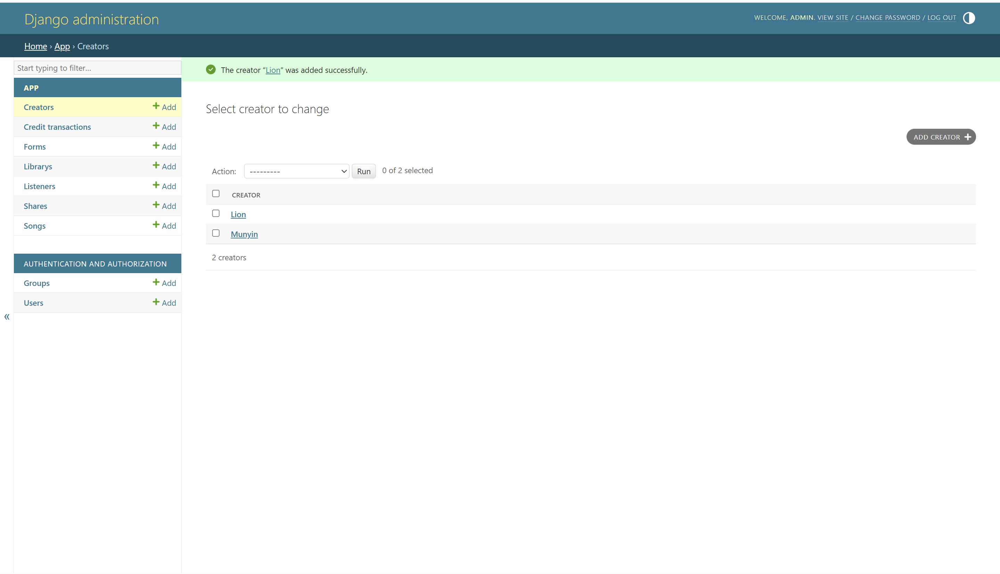

**Create Form**
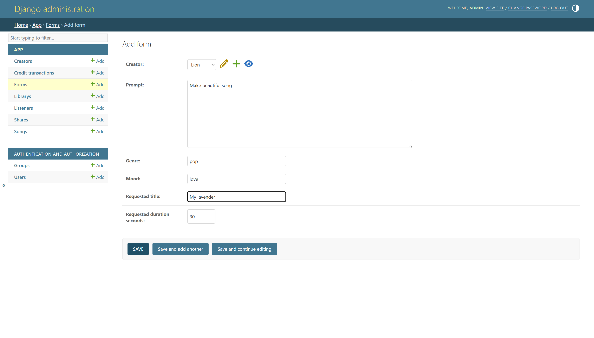

**Form Created Successfully**
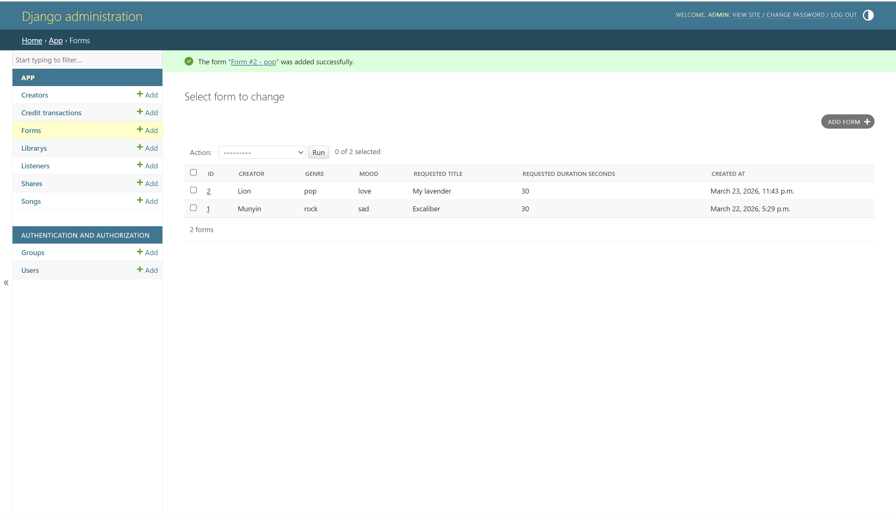

**Create Song from Form**
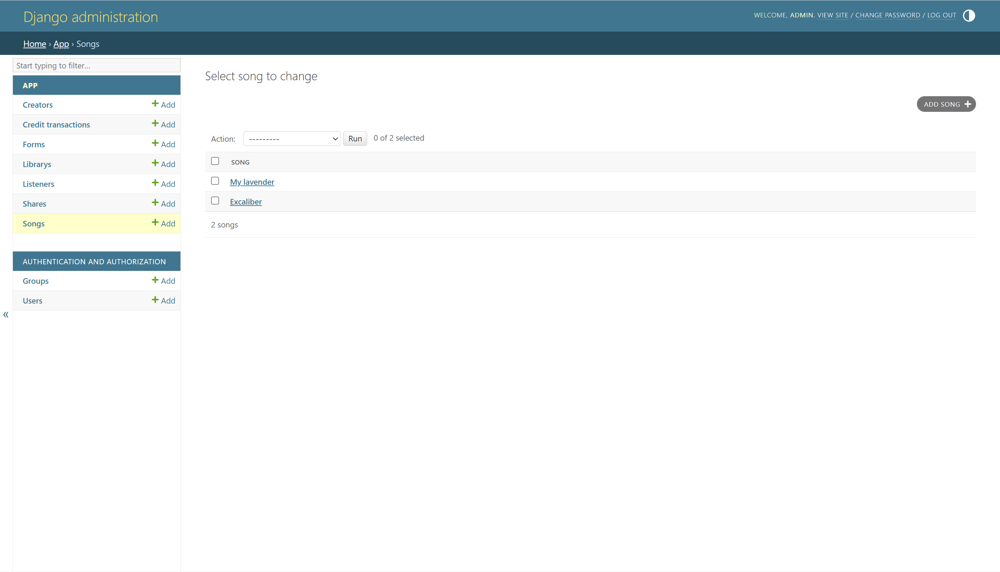

**Credit Deduction After Form Submission**
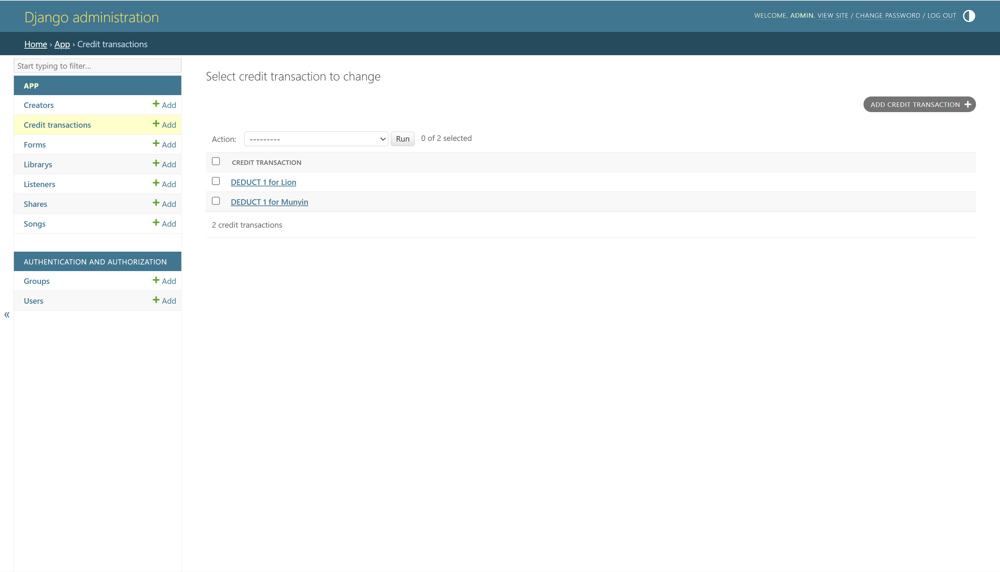

**Create Library**
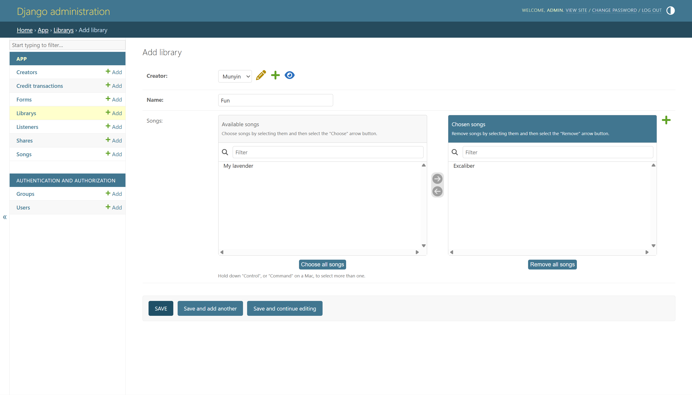

**Library Created**
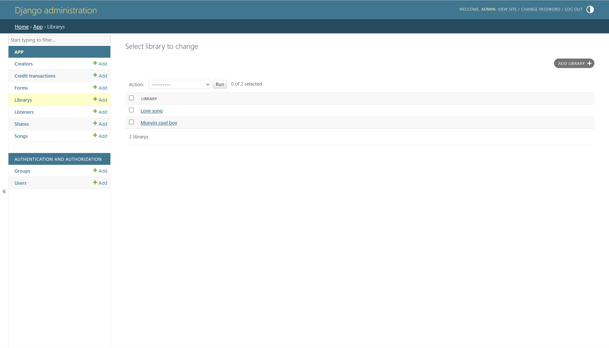

**Create Share**
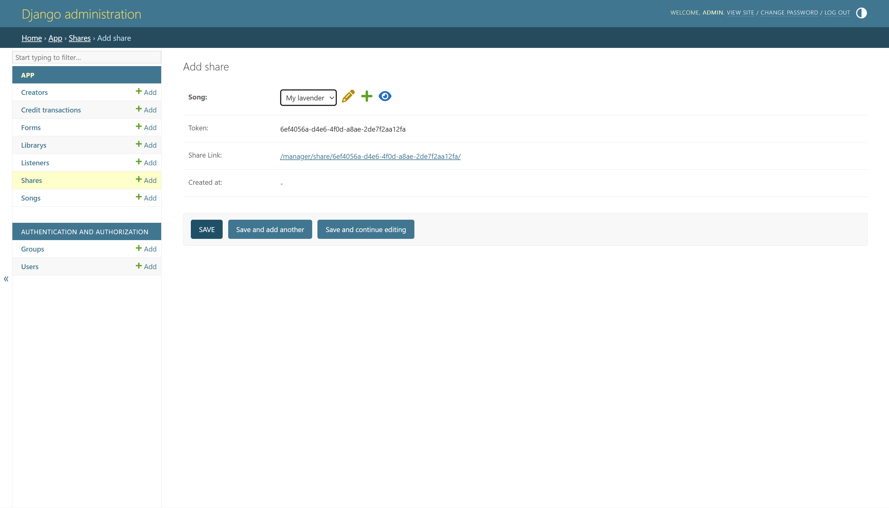

### Read

**Song List**


**Library List**


### Update

**Update Song**
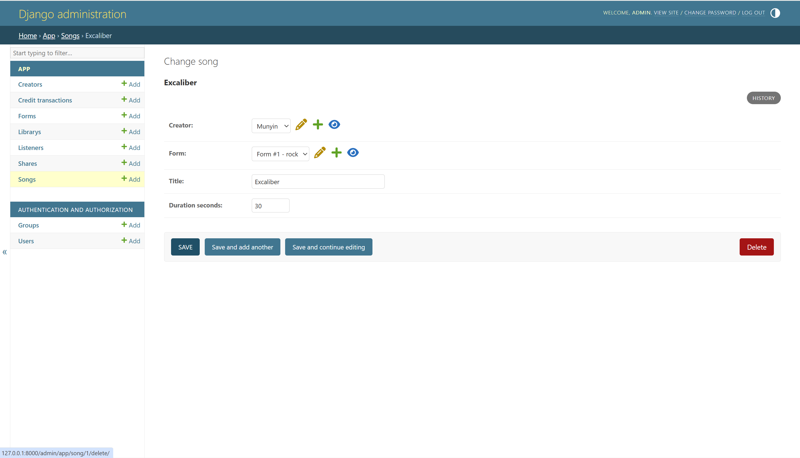

**Update Library**
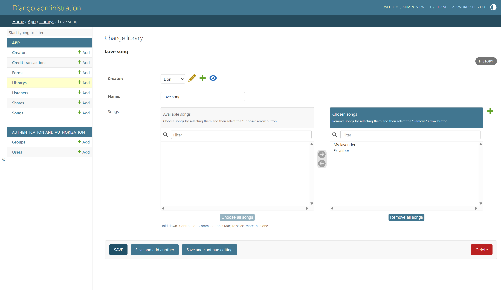

### Delete

**Delete Song - Step 1**
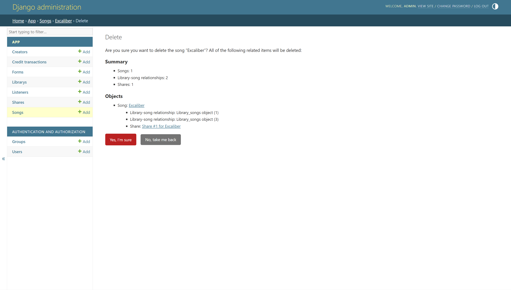

**Delete Song - Confirmation**
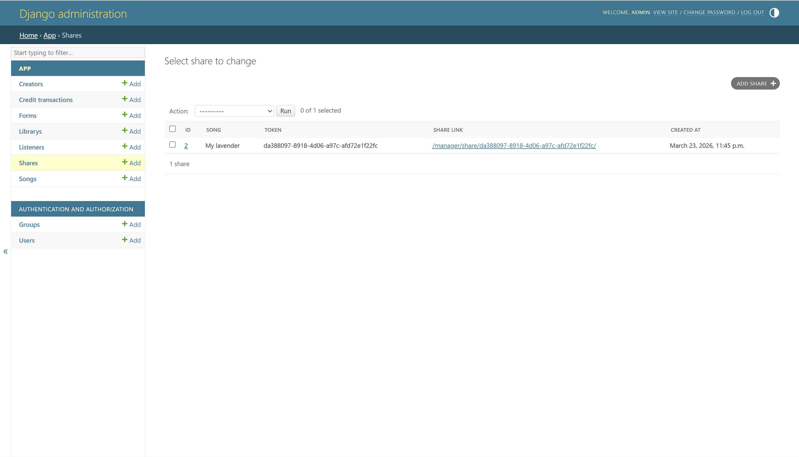

**Delete Song - Result**
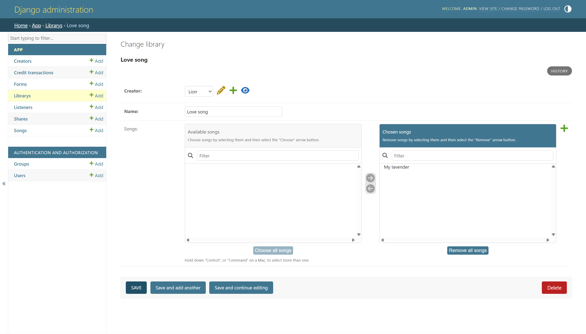

---

## Basic Route / API Structure

The application also includes a simple route/controller/service structure for future extension beyond Django Admin.

Current route groups include:

* `/generation/`
* `/playback/`
* `/manager/`
* `/user/`

Example operations supported by the current structure include:

* creating a form and mock song
* viewing creator song history
* viewing library contents
* adding songs to a library
* removing songs from a library
* viewing creator credit balance
* mock playback information

---

## Simple Custom API / View Implementation

In addition to Django Admin, this project also implements simple custom controller-based API endpoints to demonstrate functionality outside the admin interface.

These endpoints provide basic examples of custom views for managing songs, libraries, shares, and user-related information.

Implemented examples include:

- `POST /generation/create/`  
  Creates a new `Form` and generates a mock `Song`

- `GET /manager/history/<creator_id>/`  
  Returns the creator’s generated song history

- `GET /manager/library/<library_id>/`  
  Returns the songs currently stored in a library

- `POST /manager/library/<library_id>/add-song/<song_id>/`  
  Adds a selected song into a library

- `POST /manager/library/<library_id>/remove-song/<song_id>/`  
  Removes a song from a library

- `POST /manager/song/<song_id>/share/`  
  Creates a share token and share link for a song

- `GET /manager/song/<song_id>/shares/`  
  Returns all shares belonging to a song

- `GET /manager/share/<token>/`  
  Opens a shared song using the generated token

- `GET /user/balance/<creator_id>/`  
  Returns the current credit balance of a creator

These endpoints demonstrate that the project is not limited to Django Admin only and includes a simple custom API/view layer as part of the implementation.

---

## Example Endpoint Documentation

### Create Form and Mock Song

* **URL:** `/generation/create/`
* **Method:** `POST`

#### Example Request Body

```json
{
  "creator_id": 1,
  "prompt": "Energetic rock song",
  "genre": "Rock",
  "mood": "Excited",
  "requested_title": "Fire Run",
  "requested_duration_seconds": 30
}
```

#### Example Response Body

```json
{
  "message": "Song created successfully",
  "form_id": 1,
  "song_id": 1,
  "song_title": "Fire Run",
  "duration_seconds": 30
}
```

### View Creator Song History

* **URL:** `/manager/history/<creator_id>/`
* **Method:** `GET`

#### Example Response Body

```json
{
  "creator": "Alice",
  "songs": [
    {
      "id": 1,
      "title": "Fire Run",
      "duration_seconds": 30
    }
  ]
}
```

### View Creator Credit Balance

* **URL:** `/user/balance/<creator_id>/`
* **Method:** `GET`

#### Example Response Body

```json
{
  "creator": "Alice",
  "credit_balance": 9
}
```

---

## Mock Song Generation

This project does **not** integrate actual AI song generation yet.

Instead, when a **Form** is created, the system can generate a **mock Song object** using service-layer logic.
This allows the domain layer and persistence behavior to be tested without integrating an external AI model.

---

## Share Logic

Each **Share** stores an auto-generated token.
The application derives a shareable link from that token rather than storing the full URL directly in the database.

This keeps the design cleaner and avoids duplicated URL data.

---

## Credit Logic

Credits are tracked using **CreditTransaction** rather than a simple balance field.

Supported transaction types include:

* `ADD`
* `DEDUCT`
* `REFUND`

This makes the credit system easier to audit and closer to real-world transaction history behavior.

---

## Notes

* This project focuses on the **domain layer and persistence**
* Authentication is not implemented yet
* Real AI generation is not implemented yet
* Frontend UI is not implemented yet
* Playback is currently mocked/simplified
* Django Admin is currently the main CRUD interface

---

## Future Improvements

* Google OAuth / authentication
* Real AI song generation integration
* Better frontend UI
* Better playback state management
* Download support
* Listener access tracking for shared songs
* Expanded API documentation
* More complete custom views outside Django Admin

---

## Author

Name: `Sudha Sutaschuto`
Course: Software Engineering
Exercise: **Exercise 3 – Implementing the Domain Layer Using Django**