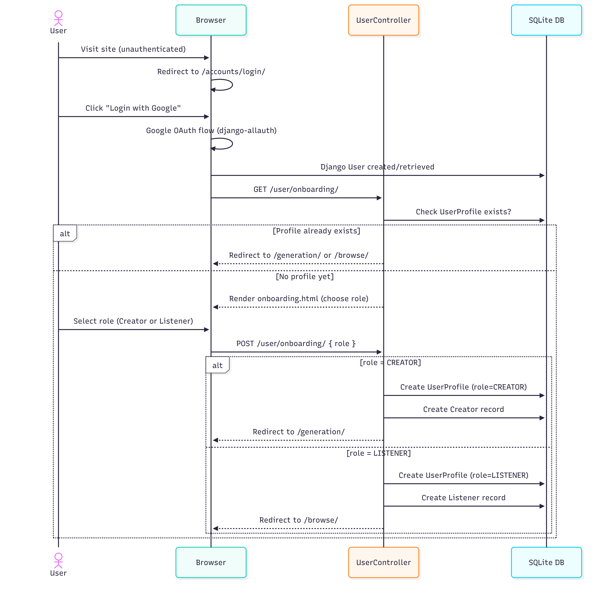
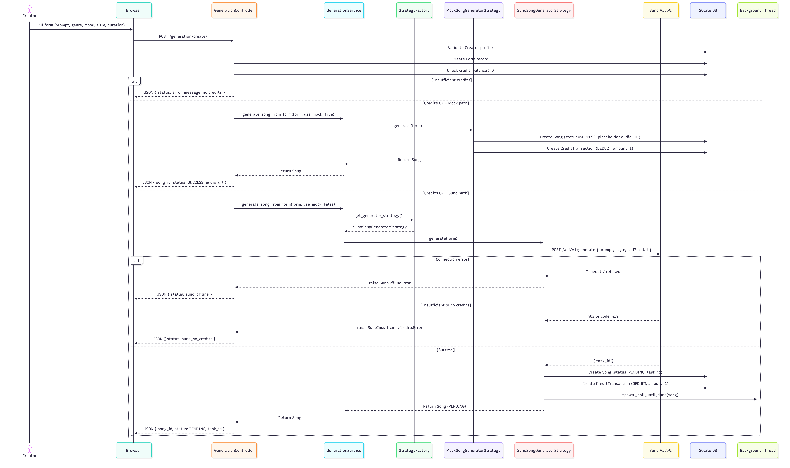
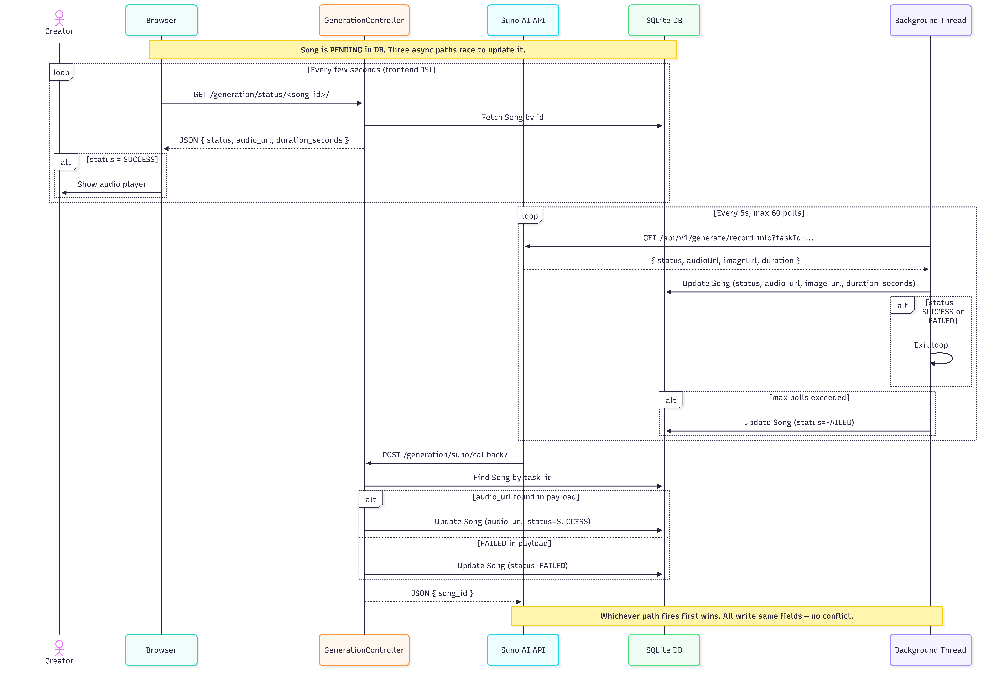
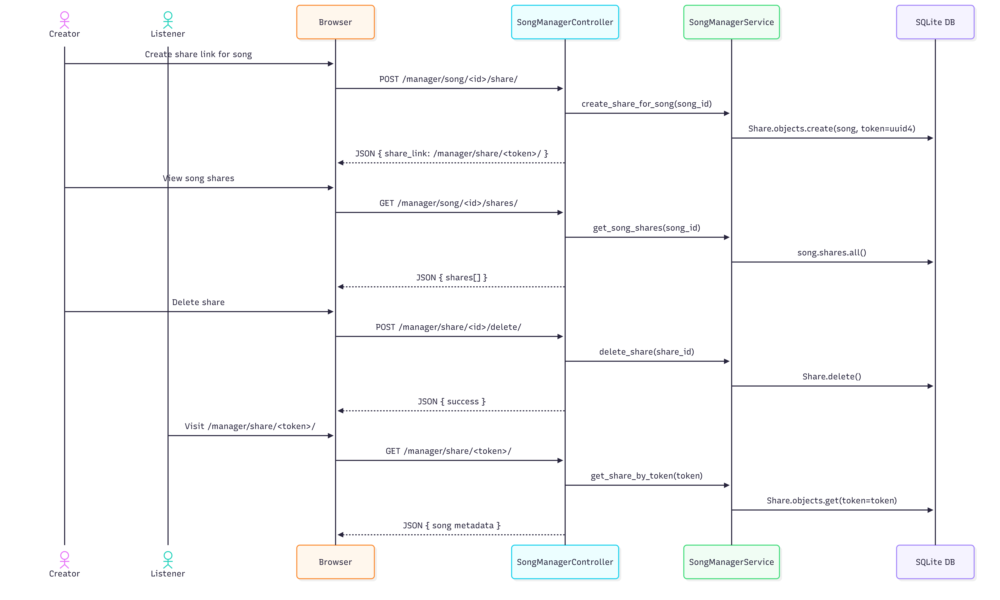
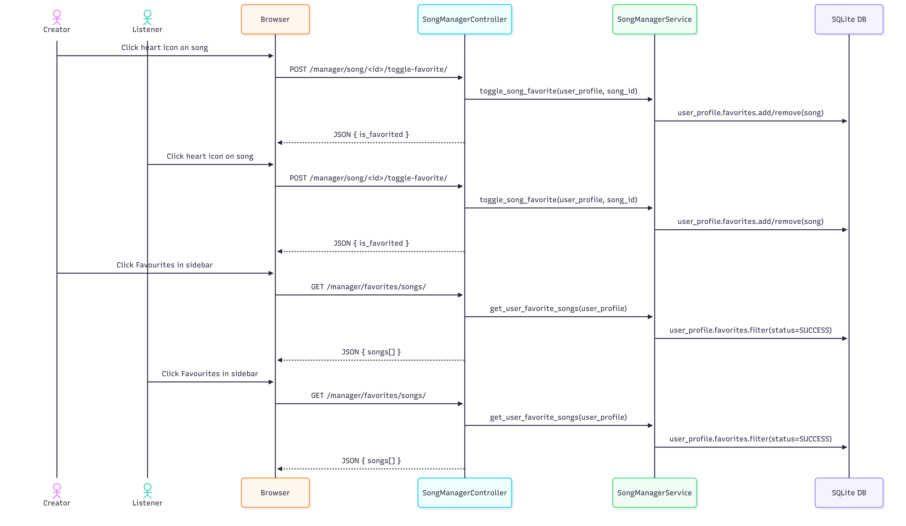
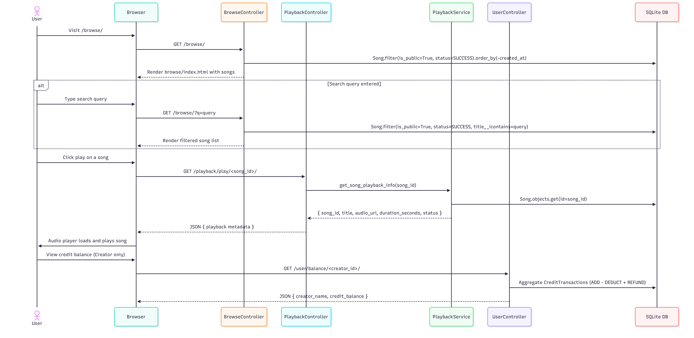

# SongGenAI

SongGenAI is a Django-based AI song generation platform.  
The system supports real song generation via the Suno API and a mock offline strategy for development and testing.

This implementation was developed for **Exercise 4: Apply Strategy Pattern for Song Generation**, building on the domain layer from Exercise 3.

---

## Project Overview

The system supports the following core flow:

1. A **Creator** registers and logs in via Google OAuth.
2. The creator submits a **Form** (prompt, genre, mood, title, duration).
3. The system generates a **Song** using the active strategy (mock or Suno API).
4. Generated songs are shown in the creator's **Song Manager** with status tracking.
5. Songs can be organized into **Libraries**, shared via token links, and toggled public/private.
6. Public songs appear on the **Browse** page for all users.
7. Credit usage is recorded through **CreditTransaction** on every generation.

---

## Main Features

- **Strategy Pattern** for song generation (mock vs Suno API, swappable via env var)
- **Mock strategy** — offline, deterministic, no API calls required
- **Suno API strategy** — real AI generation via SunoApi.org with callback support
- Google OAuth authentication
- Full frontend UI (Django Templates, Tailwind CSS, Alpine.js)
- Browse page for public songs
- Song manager: history, libraries, visibility toggle, share links, download
- **Favourites** — both Creators and Listeners can heart songs; dedicated Favourites view in manager
- Credit transaction tracking
- Global audio player with playback controls
- Django admin support

---

## Domain Entities

- **Creator**
- **Listener**
- **Form**
- **Song**
- **Library**
- **Share**
- **CreditTransaction**
- **UserProfile**

---

## Domain Relationships

- One **Creator** can have many **Forms**
- One **Creator** can have many **Songs**
- One **Creator** can have many **Libraries**
- One **Creator** can have many **CreditTransactions**
- One **Form** generates one **Song**
- One **Library** can contain many **Songs**
- One **Song** can belong to many **Libraries**
- One **Song** can have many **Shares**
- One **UserProfile** can have many favourite **Songs** (and vice versa)

---

## Project Structure

```text
project_root/
├── app/
│   ├── controllers/
│   │   ├── browse_controller.py
│   │   ├── generation_controller.py
│   │   ├── playback_controller.py
│   │   ├── song_manager_controller.py
│   │   └── user_controller.py
│   │
│   ├── models/
│   │   ├── creator.py
│   │   ├── credit_transaction.py
│   │   ├── form.py
│   │   ├── library.py
│   │   ├── listener.py
│   │   ├── share.py
│   │   ├── song.py
│   │   └── user_profile.py
│   │
│   ├── routes/
│   │   ├── browse_urls.py
│   │   ├── generation_urls.py
│   │   ├── manager_urls.py
│   │   ├── playback_urls.py
│   │   └── user_urls.py
│   │
│   ├── services/
│   │   ├── generation_service.py
│   │   ├── playback_service.py
│   │   ├── song_manager_service.py
│   │   └── user_service.py
│   │
│   ├── strategies/                   ← Strategy Pattern 
│   │   ├── base.py                   ← Abstract interface
│   │   ├── factory.py                ← Centralized strategy selection
│   │   ├── mock_strategy.py          ← Offline mock implementation
│   │   ├── suno_strategy.py          ← Suno API implementation
│   │   └── exceptions.py
│   │
│   ├── templates/
│   │   ├── base.html
│   │   ├── home.html
│   │   ├── browse/
│   │   ├── generation/
│   │   ├── manager/
│   │   ├── user/
│   │   ├── account/                  ← Auth pages
│   │   └── errors/
│   │
│   ├── migrations/
│   └── ...
│
├── config/
│   ├── settings.py
│   ├── urls.py
│   ├── asgi.py
│   └── wsgi.py
│
├── .gitignore
├── manage.py
└── README.md
```

---

## Class Diagram


---

## Sequence Diagrams

### Onboarding


### Song Generation — Request


### Song Generation — Async Completion


### Song Manager — Core


### Song Manager — Share


### Song Manager — Favourites


### Browse & Playback


---

## Installation and Setup

### 1. Clone the repository

```bash
git clone https://github.com/Lemonef/SongGenAI.git
cd SongGenAI
```

### 2. Create and activate a virtual environment

#### Windows

```bash
python -m venv venv
venv\Scripts\activate
```

#### macOS / Linux

```bash
python3 -m venv venv
source venv/bin/activate
```

### 3. Install dependencies

```bash
pip install -r requirements.txt
```

### 4. Create a `.env` file

Copy the provided template and fill in your values:

```bash
cp .env.example .env
```

```env
GENERATOR_STRATEGY=mock
SUNO_API_KEY=your_api_key_here
SUNO_CALLBACK_URL=https://your-ngrok-url/generation/suno/callback/
GOOGLE_CLIENT_ID=your_google_client_id
GOOGLE_CLIENT_SECRET=your_google_client_secret
```

Never commit `.env` — it contains secrets. Only `.env.example` is committed.

### 4a. Google OAuth Setup

1. Go to [Google Cloud Console](https://console.cloud.google.com/)
2. Create a project → **APIs & Services** → **Credentials**
3. Click **Create Credentials** → **OAuth 2.0 Client ID**
4. Application type: **Web application**
5. Add to **Authorized redirect URIs**:
   ```
   http://127.0.0.1:8000/accounts/google/login/callback/
   ```
6. Copy the **Client ID** and **Client Secret** into your `.env`
7. After running the server, go to `http://127.0.0.1:8000/admin/` → **Sites** → change `example.com` to `127.0.0.1:8000`

### 5. Apply migrations

```bash
python manage.py migrate
```

### 6. Create a superuser

```bash
python manage.py createsuperuser
```

### 7. Run the application

```bash
python manage.py runserver
```

### 8. Open the application

* Main page: `http://127.0.0.1:8000/`
* Admin page: `http://127.0.0.1:8000/admin/`

---

## Strategy Pattern: Song Generation

This project implements the **Strategy design pattern** to allow swappable song generation behavior without modifying controllers or services.

### Strategy Interface

Defined in `app/strategies/base.py`:

```python
class SongGeneratorStrategy(ABC):
    @abstractmethod
    def generate(self, form) -> Song:
        ...
```

Both strategies implement this same interface.

---

### Running in Mock Mode (Offline)

Set in your `.env` file:

```env
GENERATOR_STRATEGY=mock
```

Then restart the server. Mock mode produces a deterministic song with a fixed placeholder audio URL. No API key or internet connection required.

**Example output:**

```json
{
  "message": "Song created successfully",
  "song_title": "Generated Song 1",
  "status": "SUCCESS",
  "audio_url": "https://www.soundhelix.com/examples/mp3/SoundHelix-Song-1.mp3",
  "duration_seconds": 229
}
```

---

### Running in Suno Mode (Live API)

Set in your `.env` file:

```env
GENERATOR_STRATEGY=suno
SUNO_API_KEY=your_api_key_here
SUNO_CALLBACK_URL=https://your-ngrok-url/generation/suno/callback/
```

Then restart the server. Suno mode calls `POST https://api.sunoapi.org/api/v1/generate`, stores the returned `taskId`, and updates the song when the callback resolves.

**Example output (initial response):**

```json
{
  "message": "Song created successfully",
  "song_title": "Fire Run",
  "status": "PENDING",
  "task_id": "abc123xyz",
  "audio_url": null
}
```

Once generation completes, song status updates to `SUCCESS` with a real `audio_url`.

#### Ngrok Setup (required for Suno callbacks on localhost)

1. Download and install [ngrok](https://ngrok.com/download)
2. Run: `ngrok http 8000`
3. Copy the generated HTTPS URL (e.g. `https://abc123.ngrok-free.app`)
4. Set in `.env`: `SUNO_CALLBACK_URL=https://abc123.ngrok-free.app/generation/suno/callback/`
5. Restart the Django server

> Note: ngrok URL changes every session unless you have a paid static domain.

---

### API Key Setup

The Suno API key must **never be committed** to the repository.

1. Create a `.env` file in the project root (already listed in `.gitignore`)
2. Add your key: `SUNO_API_KEY=your_key_here`
3. Obtain a key from [sunoapi.org](https://sunoapi.org)

Settings reads it via:

```python
SUNO_API_KEY = os.environ.get("SUNO_API_KEY", "")
```

---

### Strategy Selection

Selection is centralized in `app/strategies/factory.py`:

```python
def get_generator_strategy() -> SongGeneratorStrategy:
    strategy_name = getattr(settings, "GENERATOR_STRATEGY", "mock").lower()
    if strategy_name == "suno":
        return SunoSongGeneratorStrategy()
    return MockSongGeneratorStrategy()
```

No `if/else` logic is scattered through controllers or services.

---

## Route Structure

| Prefix | Routes |
|--------|--------|
| `/` | Home page |
| `/browse/` | Public song browse page |
| `/generation/` | Song generation form, status polling, Suno callback |
| `/manager/` | Song history, libraries, shares, visibility, duration |
| `/playback/` | Global player song data |
| `/user/` | Onboarding, credit balance |
| `/accounts/` | Google OAuth login/logout |

---

## Mock Song Generation

When `GENERATOR_STRATEGY=mock`, the system generates a deterministic `Song` using a fixed placeholder audio URL and marks it `SUCCESS` immediately. No external API is called.

This allows full end-to-end testing without a Suno API key or network access.

---

## Share Logic

Each **Share** stores an auto-generated UUID token. The application derives a shareable link from that token rather than storing the full URL in the database.

---

## Credit Logic

Credits are tracked using **CreditTransaction** rather than a simple balance field.

Supported transaction types:

* `ADD`
* `DEDUCT`
* `REFUND`

---

## Notes

* Authentication implemented via Google OAuth (django-allauth)
* Real AI generation implemented via Suno API strategy
* Frontend UI implemented with Django Templates, Tailwind CSS, and Alpine.js
* Strategy selection controlled entirely by `GENERATOR_STRATEGY` env var
* `.env` file must never be committed — it contains secrets

---

## Future Improvements

* Listener access tracking for shared songs
* Expanded API documentation
* More granular credit pricing per generation length

---

## Author

Name: `Sudha Sutaschuto`  
Course: Software Engineering  
Exercise: **Exercise 4 – Apply Strategy Pattern for Song Generation**
